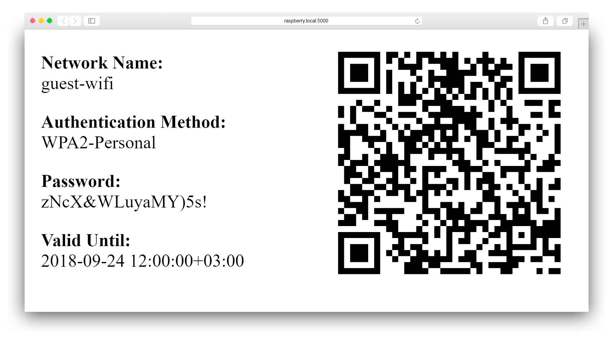

<p align="center">
    
    <br/>
    <a href="https://github.com/vrachieru/guest-wifi/releases/latest">
        
    </a>
    <a href="https://hub.docker.com/r/vrachieru/guest-wifi/">
        
    </a>
    <a href="https://hub.docker.com/r/vrachieru/guest-wifi/">
        
    </a>
    <br/>
    Easily share your wifi credentials with guests
</p>

This is a solution to a problem that I (and maybe you) have: letting your guests use your wifi when they come to visit sucks.  

Usually you have a few sucky options with their pros and cons:
* Have a weak password that you can easly share
    * PRO - makes it easy for guests to connect
    * CON - typically means your password is guessable/susceptible to brute-force style attacks
    * CON - your password doesn't change (or at least doesn't change much), so over time you might not know who has access to your network
* Have a complicated password
    * PRO - password probably isn't guessable/brute-forcible 
    * CON - it is most likely a pain to share that password
    * CON - your password still probably doesn't change often, so once it is shared, it is shared for good
* Rotate your (either strong or weak) password often
    * PRO - password is probably pretty safe because period of time that it's valid is sgnificantly less the time needed to brute-force it
    * CON - guests have to update the network password often
    * CON - you also have to actually change the password often

This project aims to provide an easy and reliable way of sharing and securing your guest wifi by automating the task of rotating strong passwords as well as facilitating their distribution via a info screen to show to your guests.  

The QR code enables guests to just scan and join the network and avoid the trouble of manually typing a funky password.  
The iOS Camera App has support for WiFi QR codes since iOS 11 and Android users can make use of [this](https://play.google.com/store/apps/details?id=com.google.zxing.client.android) app from ZXing.  

I personally have the service running on a Raspberry Pi (connected to the network via cable) and display the info page for a dedicated guest wlan on my TV but your setup can be whatever you want it to be.

### Example

<p align="center">
    
</p>


### Features

* Display connection information
* Display QR code for quick network login
* Rotate passwords automatically on predefined interval


### Quick start

I recommend pulling the [latest image](https://hub.docker.com/r/vrachieru/guest-wifi/) from Docker hub as this is the easiest way:
```bash
$ docker pull vrachieru/guest-wifi
```

If you'd like, you can build the Docker image yourself:
```bash
docker build -t <yourname>/guest-wifi .
```

Specify your desired configuration and run the container:
```bash
$ docker run -<d|i> --rm \
    -e ROUTER_USERNAME='admin' \
    -e ROUTER_SSH_KEY='/app/ssh_key' \
    -e ROUTER_WIFI_INTERFACE='wl0.1' \
    -e TZ='Europe/Bucharest' \
    -v /host/path/to/ssh_key:/app/ssh_key:ro \
    -p <host_port>:80 \
    --name guest-wifi \
    vrachieru/guest-wifi
```

You can stop the container using: 
```bash
$ docker stop guest-wifi
```


### Configuration

You can configure the service via the following environment variables.

| Environment Variable  | Default Value | Description |
| --------------------- | ------------- | ----------- |
| ROUTER_IP             | 192.168.1.1   | IP address of the router |
| ROUTER_SSH_PORT       | 22            | Port on which the ssh daemon is running |
| ROUTER_SSH_KEY        | -             | Ssh key to use while connecting to router. Note that if set it takes precedence over password login |
| ROUTER_USERNAME       | admin         | Username to use while connecting over ssh |
| ROUTER_PASSWORD       | admin         | Password to use while connecting over ssh (if you have enabled password login) |
| ROUTER_WIFI_INTERFACE | wl0.1         | Tipically your router can sustain multiple guest WLANs which are sub-interfaces of your main WLANs. In this case `wl0` is the main WLAN on 2.4GHz and `wl1` is the 5GHz equivalent. The default is the first guest interface available on 2.4GHz |
| PASSWORD_RESET_CRON   | 0 12 * * MON  | A cron style expression representing how often to rotate the password. I find that doing so once every Monday at noon is a safe bet as there's a minimal chance to have that many people around |
| PASSWORD_COMPLEXITY   | 16            | A 16 character password within the letter+digit+punctuation charset is brute-forceable in about ... well, a really long time. If you're really paranoid you can go up to 63 |
| TZ                    | UTC           | Timezone of the container


### Compatibility

Current implementation is based on `AsusWRT` routers although it may work on devices from other vendors as well without any modifications.  
Although providing your own custom implementation by extending the `Router` class shouldn't be much of a fuss.


### License

MIT